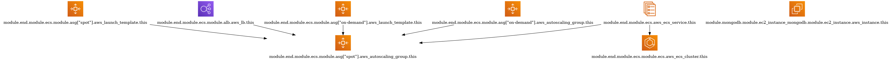

# infrastructure-modules


## build

```shell
eval COMMON_NAME=infrastrucutre-modules-common; \
eval NAME=infrastrucutre-modules; \
sudo docker build -t $COMMON_NAME -f Dockerfile.common .; \
sudo docker build -t $NAME -f Dockerfile --build-arg="VARIANT=$COMMON_NAME" .; \
sudo docker run --rm -it --name $NAME --env-file .devcontainer/devcontainer.env $NAME
```

## devcontainer

```
AWS_REGION_NAME=***
AWS_PROFILE_NAME=***
AWS_ACCOUNT_ID=***
AWS_ACCESS_KEY=***
AWS_SECRET_KEY=***

REPOSITORIES_AWS_PROFILE_NAME=***
REPOSITORIES_AWS_ACCOUNT_ID=***
REPOSITORIES_AWS_REGION_NAME=***
REPOSITORIES_AWS_ACCESS_KEY=***
REPOSITORIES_AWS_SECRET_KEY=***


ENVIRONMENT_NAME=local
GITHUB_TOKEN=***GH_TERRA_TOKEN***
DOMAIN_NAME=your-domain.com
```
GITHUB_TOKEN is required for the github cli. Otherwise terratest will print the token in the logs, for login or curl requests, which is not a safe behaviour.

In [Github](https://github.com/settings/personal-access-tokens/new):
:warning: The `GITHUB_TOKEN` is a default name

`GH_TERRA_TOKEN`:
```
Repository access
  Only select repositories: [infrastructure-modules, infrastructure-live, scraper-backend, scraper-frontend, ...]

Repository permissions
  Actions: Read and write
  Contents: Read-only
  Environments: Read and write
  Metadata: Read-only
  Pull-requests: Read and write
  Secrets: Read and write
  Variables: Read and write
```

In [AWS]():

# Github

Repo secrets:
- GH_TERRA_TOKEN

Environment secrets:
- AWS_ACCESS_KEY
- AWS_SECRET_KEY

Environment variables:
- AWS_REGION_NAME
- AWS_ACCOUNT_ID
- AWS_PROFILE_NAME

# terraform

## run

Open the project with the dev container.

Check the commands of [terraform CLI](https://www.terraform.io/cli/commands#switching-working-directory-with-chdir).

```shell
# format
terraform fmt

# steps to create infrastructure
terraform init
terraform validate
terraform plan
terraform apply

# inspect
terraform show
terraform output

# destroy the infrastructure
terraform destroy
```

<details><summary> <b>Links</b> </summary>

Check the [tutorial for AWS](https://learn.hashicorp.com/tutorials/terraform/aws-build?in=terraform/aws-get-started).
To setup a VPC check this [Medium article](# https://medium.com/swlh/creating-an-aws-ecs-cluster-of-ec2-instances-with-terraform-85a10b5cfbe3
).
To setup workflow and environments check this [Medium article](https://blog.gruntwork.io/how-to-manage-terraform-state-28f5697e68fa).

Check the [HCL](https://developer.hashicorp.com/terraform/language).

</details>

<details><summary> <b>Code</b> </summary>

For reources tags, where `tags` is a map:

```hcl
resource "aws_resource_type" "resource_name" {
  tags = merge(var.tags, {Name="..."})
}
```

Add the lifecycle policy to create before detroying to avoid downtime.
Be careful not to do it on unique resources that cannot be duplicated.

```hcl
resource "aws_resource_type" "resource_name" {
  lifecycle {
    create_before_destroy = true
  }
}
```

Add the lifecycle policy to protect from destroying it:
```hcl
resource "aws_resource_type" "resource_name" {
  lifecycle {
    prevent_destroy = true
  }
}
```

For backing up the state in an S3 bucket, insert those only in the running terraform file, which would not be in `modules`. 
The backend name is usually `backend_name="terraform-state-backend"`.
There is a different state for production and non-production environments.

```hcl
provider "aws" {
  aws_region = var.aws_region
}
```

</details>

# terragrunt

#### dependencies

[Docs](https://terragrunt.gruntwork.io/docs/features/execute-terraform-commands-on-multiple-modules-at-once/#dependencies-between-modules)

```shell
terragrunt graph-dependencies | dot -Tsvg > graph.svg
```

## variables

Variables set in the file can be overridden at deployment:

```shell
terraform apply -var <var_to_change>=<new_value>
```

## Route53

- Have a `domain` name (in this case hosted by aws)
- Create a public `Hosted zone` with the same name as the `domain` name. Make sure the `domain` name servers match the `hosted zone` name servers
- Create a record that will redirect the traffic to your desired resource
  -  For mapping to a resource, use `A` (for ipv4) or `AAAA` (for ipv6) record
     -  For a microservice Load Balancer, a record is by default created if you give the route53 variables
  -  For mapping to another DNS, use `CNAME`
     -  For HTTPS, use a certificate and add the record to the `Hosted zone`

## vpc
#### cidr

- 100.0.0.0/16 scraper-backend
- 101.0.0.0/16 scraper-frontend

Using `/16` for CIDR blocks means that the last two parts of the adress are customizable for subnets.

The recommendations are to use the first part of the CIDR for different VPCs projects. When ever there should be a clear abstraction, use a different number. The recommendation is to simply increment by 1 the value of the first value of the CIDR, e.g. `10.0.0.0/16` to `11.0.0.0/16`.

The second part of the cidr block is reserved for replicas of an environment. It could be for another region, for a new environment. `10.0.0.0/16` to `10.1.0.0/16`


To check the first and last ip of a CIDR block:

```hcl
cidrhost("192.168.0.0/16", 0)
cidrhost("192.168.0.0/16", -1)
```

# terratest 

  - make prepare
  - run each test
  - make clean

### local

Use the `RunTestStage` functionnality to disable certain parts of the code, thus not needing to constantly destroy and redeploy the instances for the same test:

```hcl
defer func() {
    if r := recover(); r != nil {
        // destroy all resources if panic
        terraform.Destroy(t, terraformOptions)
    }
    terratest_structure.RunTestStage(t, "cleanup_mongodb", func() {
        terraform.Destroy(t, terraformOptions)
    })
}()
terratest_structure.RunTestStage(t, "deploy_mongodb", func() {
    terraform.InitAndApply(t, terraformOptions)
})
terratest_structure.RunTestStage(t, "validate_mongodb", func() {
    s3bucketMongodbArn := terraform.Output(t, terraformOptions, "s3_bucket_mongodb_arn")
    s3bucketpicturesArn := terraform.Output(t, terraformOptions, "s3_bucket_pictures_arn")
    assert.Equal(t, fmt.Sprintf("arn:aws:s3:::%s", bucket_name_mongodb), s3bucketMongodbArn)
    assert.Equal(t, fmt.Sprintf("arn:aws:s3:::%s", bucket_name_pictures), s3bucketpicturesArn)
    err := testMongodbOperations()
    assert.Equal(t, nil, err)
})
```

If you need to disable one functionality, it needs to be present in the test so make sure the env is declared in the environment:

```shell
export SKIP_cleanup_mongodb=true
```

If you need to enable one functionality:

```shell
unset SKIP_cleanup_mongodb
```

# graphs

#### scraper-backend

