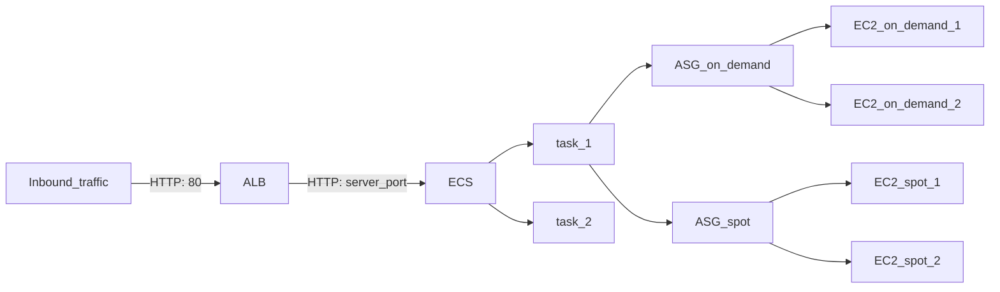

# ec2-asg

EC2 Auto Scaling Group template

```mermaid
flowchart LR
    Inbound_traffic -- HTTP: 80 --> ALB -- HTTP: server_port --> ECS
    ECS --> task_1
    task_1 --> ASG_on_demand & ASG_spot
    ASG_on_demand --> EC2_on_demand_1 & EC2_on_demand_2
    ASG_spot --> EC2_spot_1 & EC2_spot_2
    ECS --> task_2
```