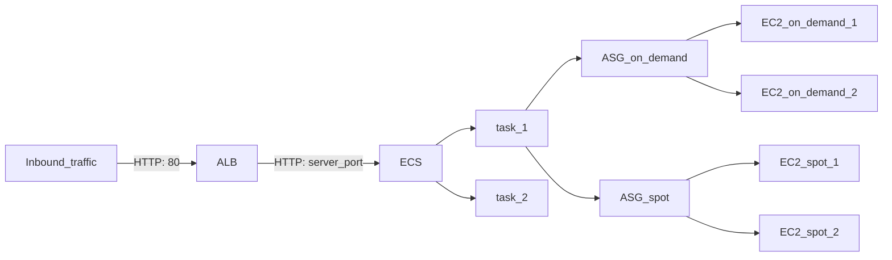

# ec2-asg

EC2 Auto Scaling Group template
Wrong but you get the flow

# network mode

- awsvpc
  - for fargate
- bridge   
  - for EC2 with many instances, it allows dynamic mapping
- host
  - for EC2 with a single instance, cannot have dynamic port mapping, hence it is not made for many instances because a port can be taken by only one instance. But it is more performant than bridge network.